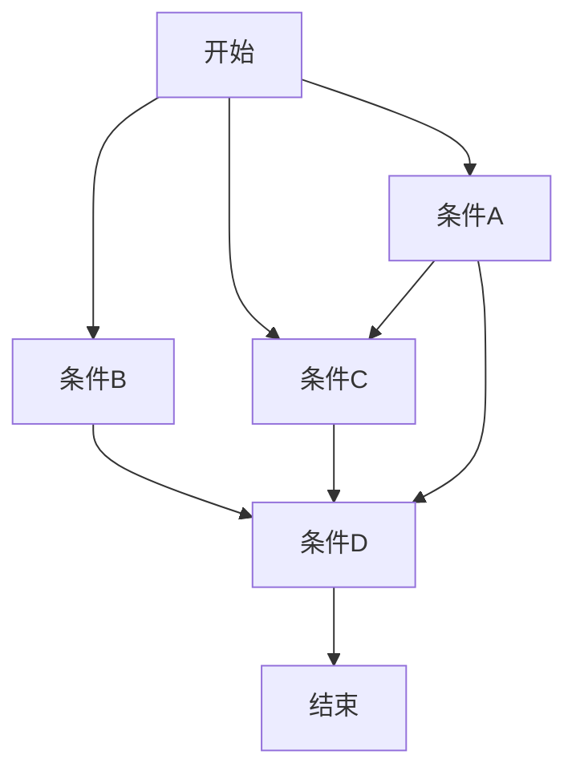

# Typora 编辑器 ———— 书写即为美学

---

[TOC]

---

官方网站: https://typora.io/

支持平台：

+ Windows
+ Linux
+ MacOS

特点：

- 完美支持Github的Markdown语法
- 人性化的书写方式：
  - 表格的书写，随意挪动
  - 图片，超链接，网页表格的复制
  - 目录生成
- 支持 $LaTex$ 公式书写
- 支持Flowchart，Mermaid等流程图的绘制
- 高亮，备注，上下标书写
- 生成网页，pdf，图片


### Markdown中基本的快捷键介绍

---

**Ctrl 0** 到 **Ctrl 4**：普通文本，一级~四级标题

**Ctrl B**: 加粗

**Ctrl I**：斜体

**Ctrl U**：下划线

**Shift + Alt + 5**： 删除线

**Ctrl K**：超链接

**Ctrl T**：表格

**Ctrl + Shift + Q**: 引用

**Ctrl + Shift + I**: 图片


### 基本的不带快捷键的Markdown语法

```python
import torch
import torch.nn as nn
```

无序，有序，任务列表：

+ 机器学习
+ 硬件设计

1. Java
2. C++
3. Python


- [x] paper reading 
- [ ] code review


参考链接：

​		深度学习很火[^1]

[^1]: AlexNet


上标和下标：

​			上标：$X^2$

​			下标：$H_2O$

高亮：

==第六，第七章补考==

注释：

<!--asdasd-->

emoji图标：

:upside_down_face:

:point_down:

Flowchart流程图

```flow

```

Mermaid流程图




